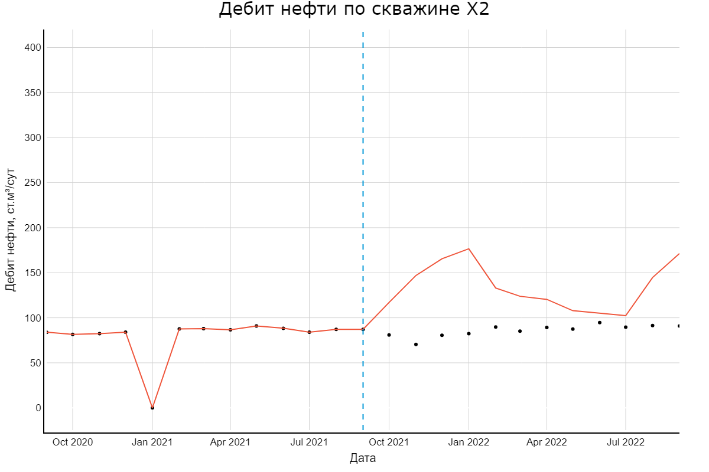

# Visualization-of-data-analysis
# Аналитическая обработка и визуализация геолого-геофизических данных для учебного группового проекта по построению геолого-гидродинамической модели (ГГДМ).

## Построение коридора неопределенности +- 3STD для петрофизических зависимостей с использованием матрицы поворота

## Построение ящиков с усами для петрофизических свойств 

## Визуализация расчетов геолого-гидродинамической модели (ГГДМ)

## Расчет и построения кривой Лоренца и коэффициента Джини

## Построения графика относительных фазовых проницаемостей

## Анимированная визуализация прохода по слайсам сейсмического куба формата SEGY

